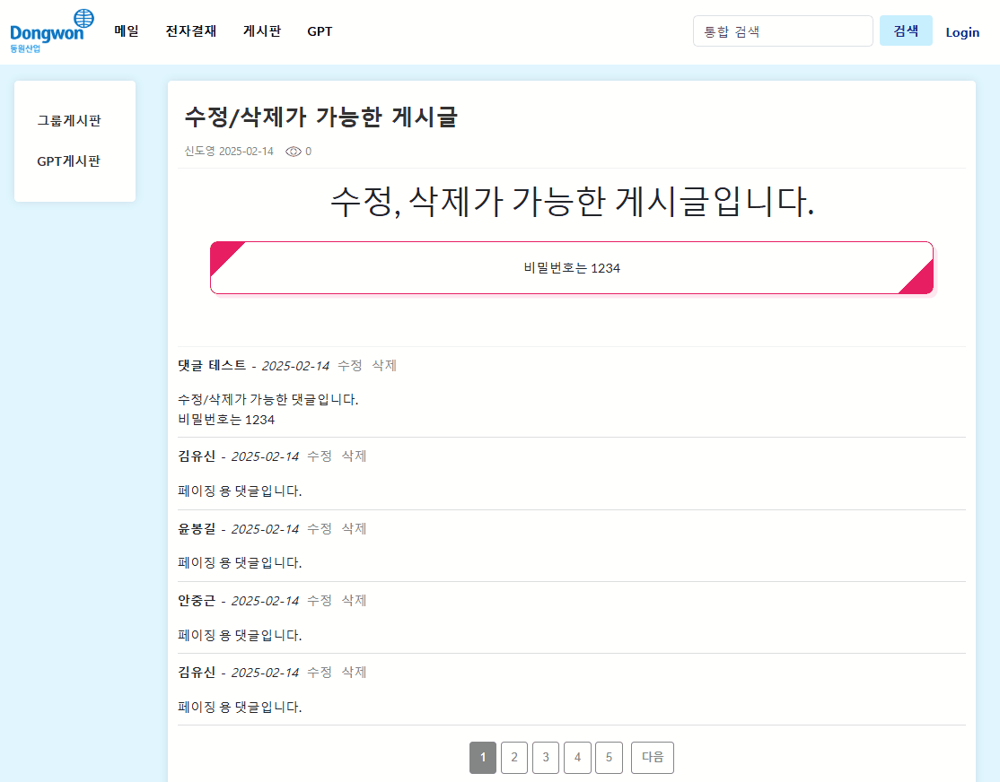
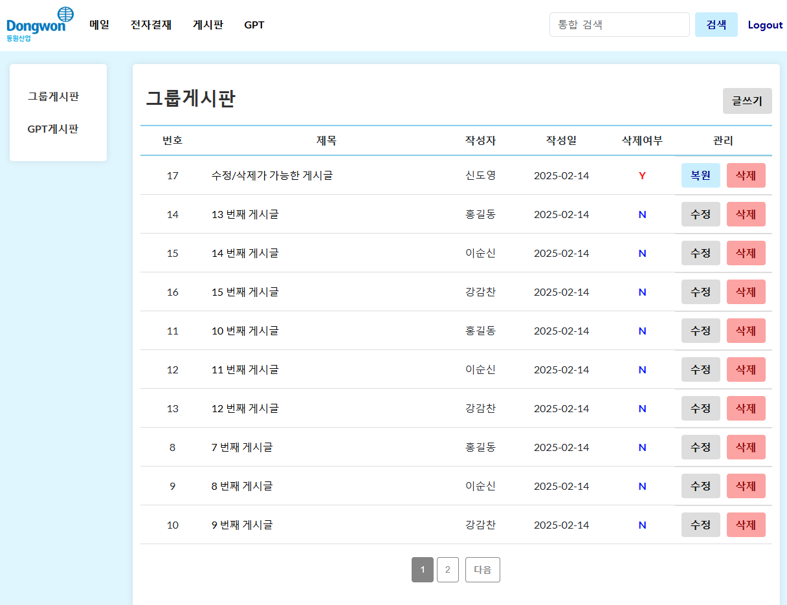

# Groupware

### 📌 프로젝트 설명  
- 다양한 기능을 탑재한 그룹웨어를 개발

## 🚀 기능  
-  [O] 게시글 등록, 조회, 수정, 삭제
-  [O] 게시글 관리자 기능 (게시글 복원, 수정, 삭제)
-  [O] 댓글 등록, 조회, 수정, 삭제
-  [O] 문서 공동 편집기 
-  [O] GPT 채팅 (Azure OpenAI)
-  [O] 게시글 조회수(Redis), 이메일 전송

## 📷 스크린샷  
### 1. 게시판 페이지  
<br>

__List__
<p>
  
  
</p>
<br>

__Post__
<p>
  
  
</p>
<br>

__Detail__
<p>
  
</p>
<br>

__Update & Delete__
<p>
  
  
</p>

<br>


### 2. 댓글
<br>

__Post__
<p>
  
</p>
<br>

__Update & Delete__
<p>
  
  
</p>
<br>  

### 3. 관리자 페이지 
<br>

__Admin Login & List__  
<p>
  
  
</p>


__Admin Restore & Delete__  
<p>
  
  
</p>
<br>

### 4. 문서 공동 편집기
<br>


<br>

### 5. 이메일 전송 템플릿
<br>


<br>

### 6. GPT 채팅
<br>

<p>
  
  
</p>
<br>

## ⏳ 개발 기간

__기본 기능__  
25.01.15 ~ 25.02.14 (4주)  
<br>

__추가 기능__  
문서 공동 편집기:  25.02.17 ~ 25.02.28 (2주)
GPT 채팅: 25.03.04 ~ 25.03.06 (3일)
<br>  

## 💻 기술 스텍

<div> 
  
   
   
   
   
  
</div>
<br>

## 💻 새로 배운 기술

__Back-End__
- .net framework를 활용한 CRUD 기능 구현
- 웹소켓 라이브러리(SignalR)를 활용한 문서 공동 편집기 구현
- Redis를 활용한 조회수, 공동 편집 문서 임시 저장 기능 구현
- 이메일 전송 비동기 처리로 UX 개선
- salt, sha256를 활용한 비밀번호 해싱
<br>

__Front-End__
- asp.net, bootstrap을 활용한 UI 구현
- XSS 방지를 위한 url 인코딩
- 서버와의 실시간 통신 구현 (문서 공동 편집기, GPT 채팅)
<br>

## 🛠 설치 및 실행 방법  

### 공통

__1. 저장소 클론__  
- git clone https://github.com/straipe/Groupware.git

__2. 디렉토리 이동__  
- cd Groupware

__3. SQL Server & SSMS 설치__

__4. SQLServer groupware2 DB 생성 및 script.sql 파일 실행__

__5. 비밀번호 및 키 값 설정__
- App_GlobalResources 폴더 -> Constants.resx 내 AdminAppPassword(구글 앱 비밀번호), AdminEmail(구글 이메일) 값 설정
- Scripts 폴더 -> editor.js 내 LICENSE_KEY값 설정(CKEditor)
- Web.config 파일 -> connectionString의 Server값 변경(SSMS의 Server 이름)
```
<add name="groupware2" connectionString="Server=SERVER_NAME;Database=groupware2;Integrated Security=True;" providerName="System.Data.SqlClient" />
```

__6. Nuget Package 콘솔에서 Migration 적용__
- Update-Database

__7. Redis 다운로드 및 실행__  

__8. Visual Studio 2022로 실행(.sin 파일)__  
